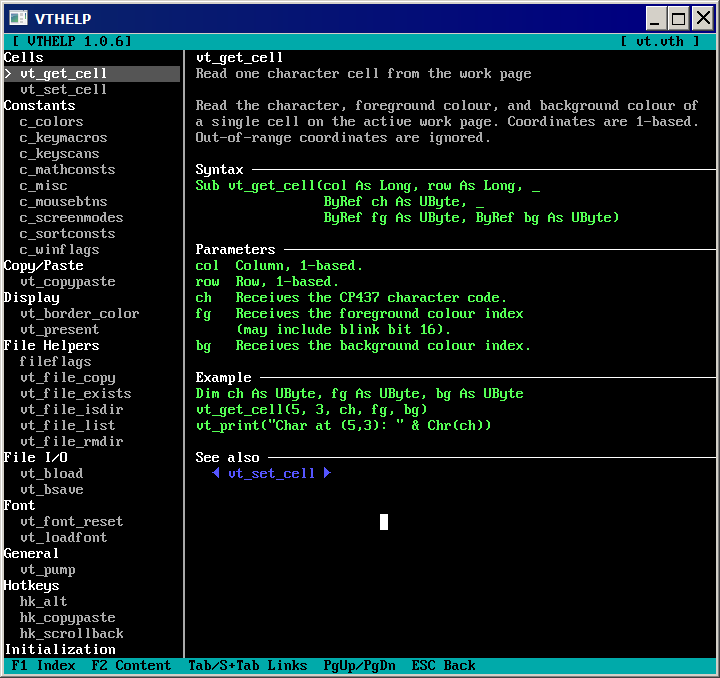

# VTHELP — DOS-style .vth Help File Viewer

> Written in FreeBASIC with [libvt](https://github.com/rbreitinger/libvt)

---



---

VTHELP is a compact, keyboard-driven help file viewer with a classic two-pane
DOS look. The left pane shows a grouped topic index; the right pane renders the
selected topic with syntax highlighting, clickable cross-reference links, and a
back-navigation stack. By default it loads **`vt.vth`** — the official offline
API reference for [libvt](https://github.com/rbreitinger/libvt) — but it can
open any `.vth` file you write yourself.

---

## Features

- Two-pane layout — grouped topic index on the left, content on the right
- Keyboard and mouse navigation throughout
- Clickable cross-reference links with Tab / Shift+Tab cycling
- Back-navigation stack (up to 32 levels deep) — Escape goes back
- Syntax-highlighted sections: syntax, parameters, notes, examples, see-also
- Mouse wheel scrolling in both panes
- Copy/paste support (Shift+Ins)
- Loads `vt.vth` automatically from the current directory when no argument given
- Opens any custom `.vth` file passed as a command-line argument
- Windows file association helpers — `register.bat` / `unregister.bat`
- Single-file executable, no installer

---

## Keyboard Reference

| Key | Action |
|---|---|
| **F1** | Focus the index pane |
| **F2** | Focus the content pane |
| **Tab** / **Shift+Tab** | Cycle through cross-reference links in content |
| **Enter** | Open selected topic (index) or follow focused link (content) |
| **Escape** | Navigate back (or beep if at the root) |
| **Up** / **Down** | Move selection / scroll one line |
| **PgUp** / **PgDn** | Scroll one page |
| **Home** / **End** | Jump to the top / bottom |

Mouse clicks on index entries and content links are also supported, as is
left-button drag-to-select and right-button copy to the clipboard.

---

## Building

### Requirements

| Dependency | Version | Notes |
|---|---|---|
| [FreeBASIC](https://www.freebasic.net) | 1.10.1 | Compiler |
| [libvt](https://github.com/rbreitinger/libvt) | 1.7.0+ | Place `vt/` folder in your FreeBASIC `inc/` folder |

Clone or download libvt and place the `vt/` directory in your FreeBASIC `inc/`
folder. Then compile:

```sh
fbc vthelp.bas
```

The `#cmdline` directive in the source already sets optimisation and
GUI-subsystem flags, so no extra compiler arguments are needed.

---

## Runtime Dependencies

| Library | Notes |
|---|---|
| SDL2 (core only) | Required by libvt at runtime |

Pre-built SDL2 binaries for Windows can be found in the
[fb-lib-archive](https://github.com/rbreitinger/fb-lib-archive/tree/main/libraries/SDL2/SDL2-2.0.14).

Place `SDL2.dll` next to the compiled executable on Windows.
On Linux, install SDL2 via your package manager (`libsdl2-dev` / `sdl2`).

---

## Usage

```sh
vthelp                  # loads vt.vth from the current directory
vthelp myfile.vth       # loads a custom help file
```

Double-clicking a `.vth` file in Explorer works automatically after running
`register.bat` (see below).

---

## Windows File Association

The repository includes two batch files for associating `.vth` files with
VTHELP on Windows:

| File | Action |
|---|---|
| `register.bat` | Associates `.vth` with `vthelp.exe` — double-click any `.vth` file to open it |
| `unregister.bat` | Removes the association |

Run either file as **Administrator**. The registration points to
`vthelp.exe` in the same directory as the batch file, so keep them
together with the executable.

---

## The .vth Format

`.vth` files are plain text. Topics are separated by `:topic` tags and
organised into named groups. Lines beginning with `'` are comments and are
ignored by the parser (except inside `:example` blocks).

The content pane is 57 characters wide, so wrap long lines at 55 characters
and use FreeBASIC's `_` line-continuation token to keep example code valid
when users copy it directly.

```
' ---- group: My Group ----
:topic my_function
:short One-line description shown in the index
:group My Group
Introductory paragraph. Describe what the
function does in plain prose here. Lines
should stay within 55 characters so they
fit comfortably in the content pane.
:syntax
Function my_function(x As Long, y As Long) _
                     As Long
:params
x  The first value.
y  The second value.
:notes
Any caveats or platform differences go here.
:example
Dim result As Long = my_function(10, 20)
vt_print Str(result) & VT_NEWLINE
vt_present()
:see
other_function
another_function
```

### Tag reference

| Tag | Purpose |
|---|---|
| `:topic <name>` | Starts a new topic. `name` is the link target used in `:see` entries. |
| `:short <text>` | One-line summary shown in the index pane. |
| `:group <name>` | Group heading the topic appears under. Defaults to `General`. |
| `:syntax` | Function signature(s). Rendered in bright green verbatim. |
| `:params` | Parameter descriptions. Rendered verbatim. |
| `:notes` | Notes, caveats, return values. Rendered verbatim. |
| `:example` | Code example. Comment lines (`'`) are preserved here. |
| `:see` | Cross-reference links — one topic name per line, one per link. |

---

## License

MIT License — Copyright © 2026 Rene Breitinger

Permission is hereby granted, free of charge, to any person obtaining a copy
of this software and associated documentation files (the "Software"), to deal
in the Software without restriction, including without limitation the rights
to use, copy, modify, merge, publish, distribute, sublicense, and/or sell
copies of the Software, and to permit persons to whom the Software is
furnished to do so, subject to the following conditions:

The above copyright notice and this permission notice shall be included in all
copies or substantial portions of the Software.

THE SOFTWARE IS PROVIDED "AS IS", WITHOUT WARRANTY OF ANY KIND, EXPRESS OR
IMPLIED, INCLUDING BUT NOT LIMITED TO THE WARRANTIES OF MERCHANTABILITY,
FITNESS FOR A PARTICULAR PURPOSE AND NONINFRINGEMENT. IN NO EVENT SHALL THE
AUTHORS OR COPYRIGHT HOLDERS BE LIABLE FOR ANY CLAIM, DAMAGES OR OTHER
LIABILITY, WHETHER IN AN ACTION OF CONTRACT, TORT OR OTHERWISE, ARISING FROM,
OUT OF OR IN CONNECTION WITH THE SOFTWARE OR THE USE OR OTHER DEALINGS IN THE
SOFTWARE.
